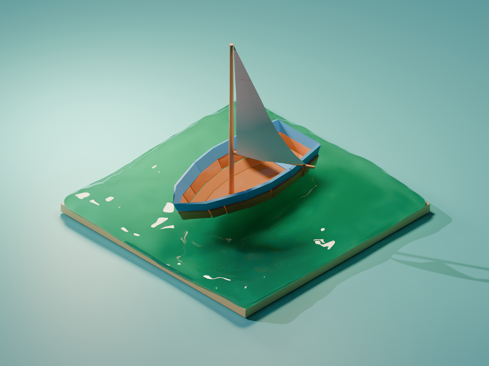

# Blender Daily Renders

A collection of daily Blender projects. Each day includes the source `.blend` file and rendered output (image and/or animation) stored in the [Output/](Output/) folder.

> **Note:** All projects in this repository were created by following tutorials from other creators, purely for **learning purposes**. Full credit for the original designs and techniques goes to the respective tutorial authors — see the [Credits](#credits) section below for links.

---

## Gallery

### Day 01 — Mug
- Source: [Day1.blend](Day1.blend) / [Day 01 - Mug.blend](Day%2001%20-%20Mug.blend)
- Image: [Output/Day01 - Mug.png](Output/Day01%20-%20Mug.png)

---

### Day 02 — Isometric Room & Ramen Bowl
- Source: [isometric room - Day 02.blend](isometric%20room%20-%20Day%2002.blend), [Ramen Bowl - Day 02.blend](Ramen%20Bowl%20-%20Day%2002.blend)
- Image: [Output/Day 2 - Isometric Room.png](Output/Day%202%20-%20Isometric%20Room.png)
- Tutorial (Isometric Room): [Isometric Room](https://www.youtube.com/watch?v=yCHT23A6aJA)
- Tutorial (Ramen Bowl): [Ramen Bowl](https://www.youtube.com/watch?v=-kpjaEU8cPU&pp=ygUQYXp1c2EgcmFtZW4gYm93bA%3D%3D)

---

### Day 03 — Rabbit
- Source: [Rabbit-Day 3.blend](Rabbit-Day%203.blend)
- Images: [01](Output/Day%2003%20-%20Rabbit-01.png), [02](Output/Day%2003%20-%20Rabbit-02.png)
- Tutorial: [Rabbit](https://www.youtube.com/watch?v=iMar3keWaUo&pp=ygUSZ3JhbnQgYWJiaXQgcmFiYml0) (Only the 3d modeling part of the tutorial was followed, not the animation part.)

---

### Day 04 — Simple Boat
- Source: [Simple Boat - Day 04.blend](Simple%20Boat%20-%20Day%2004.blend)
- Image: [Output/Day04-Boat.png](Output/Day04-Boat.png)
- Video: [Output/Day04-Boat.mp4](Output/Day04-Boat.mp4)
- Tutorial: [Simple Boat](https://www.youtube.com/watch?v=TYpY918iMc4&pp=ygUTcG9seWdvbiBydW53YXkgYm9hdA%3D%3D)

---

### Day 05 — Game Animation
- Source: [Game Animation - Day 5.blend](Game%20Animation%20-%20Day%205.blend)
- Image: [Output/Day 5 - Game Animation.png](Output/Day%205%20-%20Game%20Animation.png)
- Video: [Output/Day 5 - Game Animation.mkv](Output/Day%205%20-%20Game%20Animation.mkv)
- Tutorial: [Game Animation](https://www.youtube.com/watch?v=yHXeGCq8qH4&pp=ygUdcG9seWdvbiBydW53YXkgZ2FtZSBhbmltYXRpb24%3D)

---

### Day 06 — Animating Ship
- Source: [Animating Ship-Day 06.blend](Animating%20Ship-Day%2006.blend)
- Image: [Output/Day 06 - Ship.png](Output/Day%2006%20-%20Ship.png)
- Video: [Output/Day 06 - Ship.mkv](Output/Day%2006%20-%20Ship.mkv)
- Tutorial: [Low Poly Boat](https://www.youtube.com/watch?v=Fj9RGlhQjOs&pp=ygUYcG9seWdvbiBydW53YXkgZ2FtZSBzaGlw)

---

### Day 07 — Ramen Shop
- Source: [Ramen Shop - Day 07.blend](Ramen%20Shop%20-%20Day%2007.blend)
- Image: [Output/Day 07 - Ramen Shop.png](Output/Day%2007%20-%20Ramen%20Shop.png)
- Video: [Output/Day 07 - Game Shop.mkv](Output/Day%2007%20-%20Game%20Shop.mkv)
- Tutorial: [Blender 5.0](https://www.youtube.com/watch?v=K7__BjW4UWE&pp=ygUZcG9seWdvbiBydW53YXkgcmFtZW4gc2hvcA%3D%3D)

---

### Day 08 — Coffee & Tea
- Source: [Coffee - Day 08.blend](Coffee%20-%20Day%2008.blend), [Tea - Day 08.blend](Tea%20-%20Day%2008.blend)
- Images: [Coffee](Output/Day%2008%20-%20Coffee.png), [Tea](Output/Day%2008%20-%20Tea.png)
- Video: [Output/Day 08 - Coffee.mkv](Output/Day%2008%20-%20Coffee.mkv)
- Tutorial (Coffee): [Blender Steaming Cup of Coffee](https://www.youtube.com/watch?v=8jv2n2RElf4&pp=ygUVcG9seWdvbiBydW53YXkgY29mZmVl)

---

### Day 09 — Flag
- Source: [Flag - Day 09.blend](Flag%20-%20Day%2009.blend)
- Image: [Output/Day 09 - Flag.png](Output/Day%2009%20-%20Flag.png)
- Video: [Output/Day 09 - Flag.mkv](Output/Day%2009%20-%20Flag.mkv)
- Tutorial: [Flag Stimulation](https://www.youtube.com/watch?v=WGKiS_c5GMw&pp=ygUTcG9seWdvbiBydW53YXkgZmxhZw%3D%3D)

---

### Day 10 — Falling Leaves
- Source: [Falling Leaves - Day 10.blend](Falling%20Leaves%20-%20Day%2010.blend)
- Image: [Output/Day 10 - Falling Leaves.png](Output/Day%2010%20-%20Falling%20Leaves.png)
- Video: [Output/Day 10 - Falling Leaves.mkv](Output/Day%2010%20-%20Falling%20Leaves.mkv)
- Tutorial: [Blender Falling Leaves](https://www.youtube.com/watch?v=kOAPir1-Amc&pp=ygUdcG9seWdvbiBydW53YXkgZmFsbGluZyBsZWF2ZXM%3D)

---

### Day 11 — Ice Cream Truck
- Source: [Day 11 - Icecream truck.blend](Day%2011%20-%20Icecream%20truck.blend)
- Image: [Output/Day 11 - Ice cream Truck.png](Output/Day%2011%20-%20Ice%20cream%20Truck.png)
- Tutorial: [Blender Truck](https://www.youtube.com/watch?v=ponY2Gm5Zkw&pp=ygUgcG9seWdvbiBydW53YXkgZmFsbGluZyBpY2UgY3JlYW0%3D)

---

### Day 12 — Potted Plant
- Source: [Day 12 - Plant.blend](Day%2012%20-%20Plant.blend)
- Image: [Output/Day 12 - Potted Plant.png](Output/Day%2012%20-%20Potted%20Plant.png)
- Tutorial: [Blender Stylized Plant](https://www.youtube.com/watch?v=e_hZtBPjILw&pp=ygUbcG9seWdvbiBydW53YXkgcG90dGVkIHBsYW50)

---

### Day 13 — 3D Objects
- Source: [Day 13 - Objects.blend](Day%2013%20-%20Objects.blend)
- Image: [Output/Day 13 - 3D Objects.png](Output/Day%2013%20-%203D%20Objects.png)
- Tutorial: [Blender 3D Objects](https://www.youtube.com/watch?v=f_6Wau9WExk)

---

### Day 14 — Flower Animation
- Source: [Day 14 - Flower Animation.blend](Day%2014%20-%20Flower%20Animation.blend)
- Image: [Output/Day 14 - Flower.png](Output/Day%2014%20-%20Flower.png)
- Video: [Output/Day 14 - Flower.mkv](Output/Day%2014%20-%20Flower.mkv)
- Tutorial: [Flower Animation](https://www.youtube.com/watch?v=KvPBTwCPOY0&pp=ygUVcG9seWdvbiBydW53YXkgZmxvd2Vy)

---

### Day 15 — Factory Animation
- Source: [Day 15 - Factory Animation.blend](Day%2015%20-%20Factory%20Animation.blend)
- Image: [Output/Day 15 - Factory.png](Output/Day%2015%20-%20Factory.png)
- Video: [Output/Day 15 - Factory Animation.mp4](Output/Day%2015%20-%20Factory%20Animation.mp4)
- Tutorial: [Factory Animation](https://www.youtube.com/watch?v=OhzcCsR_EO0)

---

### Day 16 — Keypad Animation
- Source: [Day 16 - Keypad Animation.blend](Day%2016%20-%20Keypad%20Animation.blend)
- Images: [Access](Output/Day%2016%20-%20Keypad%20-%20Access.png), [Denied](Output/Day%2016%20-%20Keypad%20-%20Denied.png)
- Video: [Output/Day 16 - Keypad - Animation.mkv](Output/Day%2016%20-%20Keypad%20-%20Animation.mkv)
- Tutorial: [Blender Keypad Animation](https://www.youtube.com/watch?v=aMl1AucoqQU)

---

### Day 17 - Truck Animation
 - Source : [Day 17 - Truck Animation.blend](Day%2017%20-%20Truck%20Animation.blend)
 - Image : [Output/Day 17 - Truck.png](Output/Day%2017%20-%20Truck.png)
 - Video : [Output/Day 17 - Truck Animation.mkv](Output/Day%2017%20-%20Truck%20Animation.mkv)
 - Tutorial : [Blender Truck Animation](https://www.youtube.com/watch?v=XDF0D2M4qq8)

 

 ---

### Day 18 — Chess
- Source: [Day 18 - Chess.blend](Day%2018%20-%20Chess.blend)
- Image: [Output/Day 18 - Chess.png](Output/Day%2018%20-%20Chess.png)
- Tutorial: [Blender Chess](https://www.youtube.com/watch?v=Iu8jV7g9Oqk)

---

### Day 19 — Ocean Waves
- Source: [Day 19 - Ocean Waves.blend](Day%2019%20-%20Ocean%20Waves.blend), [Buoy.blend](Buoy.blend)
- Image: [Output/Day 19 - Ocean.png](Output/Day%2019%20-%20Ocean.png)
- Video: [Output/Day 19 - Ocean.mkv](Output/Day%2019%20-%20Ocean.mkv)
- Tutorial: [Ocean Blender](https://www.youtube.com/watch?v=oysCSbhXYBo&pp=ygUNb2NlYW4gYmxlbmRlcg%3D%3D)

---

### Day 20 — Minecraft
- Source: [Day 20 - Mine craft.blend](Day%2020%20-%20Mine%20craft.blend)
- Images: [Steve](Output/Day%2020%20-%20Minecraft-Steve.png), [Alex](Output/Day%2020%20-%20Minecraft-Alex.png), [Steve & Alex](Output/Day%2020%20-%20Minecraft-Steve%20%26%20Alex.png)

---

## Assets

- **HDRIs:** [hdri/](hdri/) — `blue_lagoon_night_4k.exr`, `grasslands_sunset_4k.exr`
- **Textures:** [textures/](textures/), plus [coffee texture.jpg](coffee%20texture.jpg)

## Credits

All models in this repository were built for **learning purposes** by following tutorials from other creators. Full credit for the original designs and techniques goes to the respective tutorial authors.

| Day | Project | Tutorial |
| --- | --- | --- |
| 02 | Isometric Room | [YouTube - Polygon Runaway](https://www.youtube.com/watch?v=yCHT23A6aJA) |
| 02 | Ramen Bowl | [YouTube- Azusa Tojo](https://www.youtube.com/watch?v=-kpjaEU8cPU) |
| 03 | Rabbit | [YouTube - Grant Abbit](https://www.youtube.com/watch?v=iMar3keWaUo) (modeling only) |
| 04 | Simple Boat | [YouTube - Polygon Runaway](https://www.youtube.com/watch?v=TYpY918iMc4) |
| 05 | Game Animation | [YouTube - Polygon Runaway](https://www.youtube.com/watch?v=yHXeGCq8qH4) |
| 06 | Animating Ship | [YouTube - Polygon Runaway](https://www.youtube.com/watch?v=Fj9RGlhQjOs) |
| 07 | Ramen Shop | [YouTube - Polygon Runaway](https://www.youtube.com/watch?v=K7__BjW4UWE) |
| 08 | Coffee | [YouTube - Polygon Runaway](https://www.youtube.com/watch?v=8jv2n2RElf4) |
| 09 | Flag | [YouTube - Polygon Runaway](https://www.youtube.com/watch?v=WGKiS_c5GMw) |
| 10 | Falling Leaves | [YouTube - Polygon Runaway](https://www.youtube.com/watch?v=kOAPir1-Amc) |
| 11 | Ice Cream Truck | [YouTube - Polygon Runaway](https://www.youtube.com/watch?v=ponY2Gm5Zkw) |
| 12 | Potted Plant | [YouTube - Polygon Runaway](https://www.youtube.com/watch?v=e_hZtBPjILw) |
| 13 | 3D Objects | [YouTube - Polygon Runaway](https://www.youtube.com/watch?v=f_6Wau9WExk) |
| 14 | Flower Animation | [YouTube - Polygon Runaway](https://www.youtube.com/watch?v=KvPBTwCPOY0&pp=ygUVcG9seWdvbiBydW53YXkgZmxvd2Vy) |
| 15 | Factory Animation | [YouTube - Polygon Runaway](https://www.youtube.com/watch?v=OhzcCsR_EO0) |
| 16 | Keypad Animation | [YouTube - Polygon Runaway](https://www.youtube.com/watch?v=aMl1AucoqQU) |
| 17 | Truck Animation | [YouTube - Polygon Runaway](https://www.youtube.com/watch?v=XDF0D2M4qq8) |
| 18 | Chess | [YouTube - Polygon Runaway](https://www.youtube.com/watch?v=Iu8jV7g9Oqk) |
| 19 | Ocean Waves | [YouTube - Blender Made Easy](https://www.youtube.com/watch?v=oysCSbhXYBo) |

> If you are a tutorial author and would like attribution updated or content removed, please open an issue.

## Notes

- Videos are provided as `.mkv` / `.mp4` — click the video links above to download/play locally. GitHub does not inline-render these formats.
